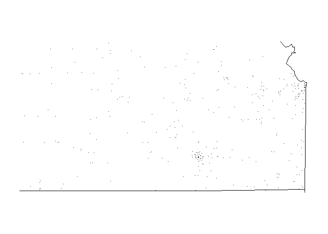

<!-- README.md is generated from README.Rmd. Please edit that file -->
farsdata
========

<!-- badges: start -->
[](https://travis-ci.com/hahustat/farsdata)
<!-- badges: end -->
Installation
------------

the development version from [GitHub](https://github.com/) with:

``` r
# install.packages("devtools")
devtools::install_github("hahustat/farsdata")
```

``` r
knitr::opts_chunk$set(
  collapse = TRUE,
  comment = "#>"
)
```

Package Description
===================

`farsdata` package loads data from the US National Highway Traffic Safety Administration's Fatality Analysis Reporting System(FARS).`FARS` data is a nationwide census providing the American public yearly data regarding fatal injuries suffered in motor vehicle traffic crashes. <https://www.nhtsa.gov/Data/Fatality-Analysis-Reporting-System-(FARS)>.

install.packages("devtools")
============================

devtools::install\_github("hahustat/farsdata")
==============================================

``` r
library(farsdata)
library(dplyr)
#> 
#> Attaching package: 'dplyr'
#> The following objects are masked from 'package:stats':
#> 
#>     filter, lag
#> The following objects are masked from 'package:base':
#> 
#>     intersect, setdiff, setequal, union
library(maps)
```

Loading/reading data
====================

``` r
list.files(system.file("extdata", package = "farsdata"))
#> [1] "accident_2013.csv.bz2" "accident_2014.csv.bz2" "accident_2015.csv.bz2"
```

`make_filename` function
------------------------

A function with input of year from 2013-2015 and returns a file and a path to the data files in the source package.

``` r
year_input<-2013
make_filename(year_input)
#> [1] "C:/Users/Tedros/Documents/R/win-library/4.0/farsdata/extdata/accident_2013.csv.bz2"
```

`fars_read_year` function
-------------------------

A function which takes an input of years and uses `make_file` function to create a file, and then reads for each year using a function `fars_read`. Result of this function will be used as input to function `fars_summarize_years`.

``` r
library(dplyr)
fars_read_years(2015)
#> [[1]]
#> # A tibble: 32,166 x 2
#>    MONTH  year
#>    <dbl> <dbl>
#>  1     1  2015
#>  2     1  2015
#>  3     1  2015
#>  4     1  2015
#>  5     1  2015
#>  6     1  2015
#>  7     1  2015
#>  8     1  2015
#>  9     1  2015
#> 10     1  2015
#> # ... with 32,156 more rows
```

`fars_summarize_years` function
-------------------------------

Taking organized data by function `fars_read_year`, summarizes yearly accidents data by month.

``` r
fars_summarize_years(c(2013,2014,2015))
#> # A tibble: 12 x 4
#>    MONTH `2013` `2014` `2015`
#>    <dbl>  <int>  <int>  <int>
#>  1     1   2230   2168   2368
#>  2     2   1952   1893   1968
#>  3     3   2356   2245   2385
#>  4     4   2300   2308   2430
#>  5     5   2532   2596   2847
#>  6     6   2692   2583   2765
#>  7     7   2660   2696   2998
#>  8     8   2899   2800   3016
#>  9     9   2741   2618   2865
#> 10    10   2768   2831   3019
#> 11    11   2615   2714   2724
#> 12    12   2457   2604   2781
```

`fars_map_state` function
-------------------------

It displays a map of the inpute state of US for these have accidents by location and yearly.

``` r
state.num<-20
year_input<-2013
fars_map_state(state.num,year_input)
```


